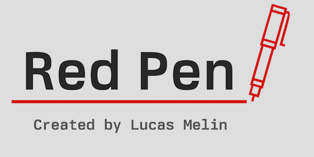

<h1 align="center">Red Pen</h1>

<p align="center">
Red Pen acts as a proofreader for your writing.
</br>
It highlights phrases that could use simplifying, identifies <a href="https://en.wikipedia.org/wiki/Weasel_word">weasel words</a>, <a href="https://en.wikipedia.org/wiki/Hedge_%28linguistics%29">hedges</a>, <a href="https://en.wikipedia.org/wiki/Filler_%28linguistics%29">filler</a>, and many more.
</br>
</br>

</br>
Red Pen is implemented as a <a href="https://github.com/retextjs/retext">retext</a>-based plugin for the <a href="https://obsidian.md">Obsidian</a> note-taking app.
</br>
</br>
<a href="https://builtwithnix.org">

</a>

</p>

## Development

This project uses TypeScript to provide type checking and documentation.
The repo depends on the latest plugin API (`obsidian.d.ts`) in TypeScript Definition format, which contains TSDoc comments describing what it does.

### NodeJS instructions

[Install NodeJS](https://nodejs.org/en).

Navigate to the plugin directory.

```bash
cd red-pen
```

Install the project dependencies.

```bash
npm install
```

Compile the source code. The following command keeps running in the terminal and rebuilds the plugin when you modify the source code.

```bash
npm run dev
```

### Nix instructions

[Install Nix](https://github.com/DeterminateSystems/nix-installer) as well as [`direnv`](https://direnv.net/).

Navigate to the plugin directory.

```bash
cd red-pen
```

Run `nix build` to compile the plugin.

The resulting `main.js`, `styles.css`, and `manifest.json` can then be found in the [`./result/lib/node_modules/red-pen`](./result/lib/node_modules/red-pen) directory.

## Manually installing the plugin

Copy over `main.js`, `styles.css`, `manifest.json` to your Obsidian Vault `<VaultFolder>/.obsidian/plugins/red-pen/`.
